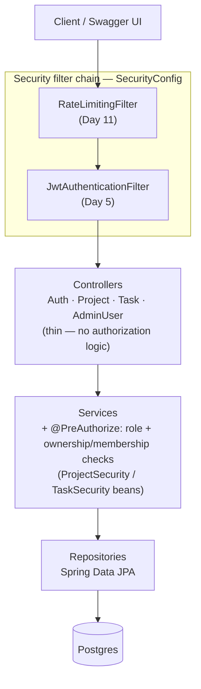
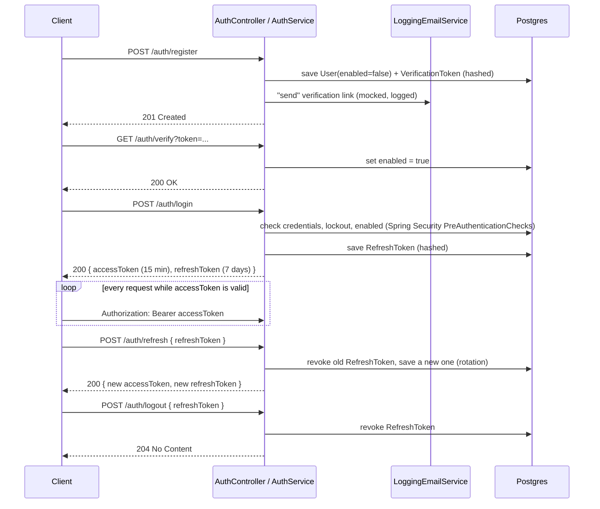

# TaskFlow — Auth & Authorization Service

A secure REST API demonstrating JWT authentication, role-based access control, and ownership-based authorization in Spring Boot. This is Project 2 of a 3-project backend portfolio (Core REST API → **Auth & Authorization** → Production-grade Booking/Order System).

**Status:** ✅ Roadmap complete (Day 18), followed by a post-roadmap hardening pass. All 18 days shipped, from Day 1's project skeleton through Day 17's OpenAPI docs and Day 18's README. A later review pass fixed a rate-limiter bypass, a duplicate-token 500, and several error-handling gaps, and added a one-command end-to-end runner. See [What's new after Day 18](#whats-new-after-day-18--hardening--tooling) for that pass, [Architecture](#architecture) for the diagrams, and [Roadmap](#roadmap) for the full day-by-day record.

---

## What's new after Day 18 — hardening & tooling

Nothing new was added to the roadmap here. This is a review pass over the finished project that turned up real bugs, fixed them, and added tooling so the whole API can be verified with one command. Each fix below has its own entry in [Design decisions](#design-decisions-living-section-updated-as-the-project-grows).

**Security fixes**

- **Rate limiter no longer trusts `X-Forwarded-For`.** `RateLimitingFilter` used to key buckets on the first value of that header whenever it was present. Since a client controls the header, anyone could get a fresh 20-request bucket per request just by changing it, which defeated the limiter entirely. It now keys on the TCP peer address (`request.getRemoteAddr()`) only. Behind a reverse proxy you control, the filter's javadoc points at Spring Boot's `server.forward-headers-strategy=native` plus Tomcat's `remoteip.internal-proxies` instead.
- **Access and refresh tokens now carry a unique `jti`.** `iat` has one-second resolution, so two tokens of the same type for the same user issued in the same second were byte-identical. That collided with the `UNIQUE` constraint on `refresh_tokens.token_hash` and surfaced as a `500` on login or refresh. A random UUID `jti` makes every token unique.

**Correctness fixes**

- **`@PreAuthorize` denials now return `403` instead of `500`.** `AccessDeniedException` (and its Spring Security 6.3+ subclass `AuthorizationDeniedException`) is thrown from inside the controller/service call, so it reaches `GlobalExceptionHandler` before the security chain's `RestAccessDeniedHandler` does. Without a dedicated handler, the catch-all turned every "wrong role / not the owner" into a `500`.
- **More client mistakes return the right status.** Malformed JSON, an unknown enum value, a missing query param, or a wrong-typed path variable now return `400`. Unknown routes return `404`, and unsupported HTTP methods return `405`.
- **`ProjectSecurity` and `TaskSecurity` are `@Transactional(readOnly = true)`.** They read lazy associations (`owner`, `members`, `project`) and need a session of their own to do that safely.
- **Filter registration order fixed in `SecurityConfig`.** `addFilterBefore(x, Y.class)` only works if `Y` is already registered, so the JWT filter is registered first (relative to a built-in filter) and the rate limiter is placed before it. The resulting chain is unchanged: `RateLimitingFilter` → `JwtAuthenticationFilter` → `UsernamePasswordAuthenticationFilter`.
- **Removed the explicit Hibernate dialect** from `application.yml`. Hibernate detects PostgreSQL on its own, and pinning it only produced a deprecation warning.

**Tests**

- **`AbstractIntegrationTest` uses the singleton-container pattern** (a `static` initializer starts Postgres once per JVM) instead of `@Testcontainers`/`@Container`. The extension stopped the container after each test class while Spring kept reusing a cached context pointing at it, so later classes failed with `Connection refused`.
- **`RateLimitIntegrationTest` simulates clients by setting the remote address**, since the header is no longer trusted, and has a new test, `spoofedXForwardedForHeader_doesNotGrantAFreshBucket`, which locks the bypass fix in.

**Tooling & housekeeping**

- **[`taskflow_e2e.py`](#one-command-end-to-end-runner)** automates the full end-to-end walkthrough below: Docker, the app, mock-email token capture, every Day 4–13 check, and a pass/fail summary.
- **`LICENSE` added** (MIT), matching the License section at the bottom.

## What's new in Day 18

The roadmap's own framing for today is worth repeating: "this is what actually gets read." Nothing here is new *behavior* — Day 18 touches only this README, per the roadmap's own final commit description — it's making everything the previous 17 days actually built legible to someone who didn't watch it happen.

- **Architecture diagrams** — a layered flowchart (client → filter chain → controllers → services → repositories → Postgres) and an auth-flow sequence diagram (register → verify → login → refresh rotation → logout), both as Mermaid rather than an exported draw.io PNG. See [Architecture](#architecture) above, and the design decision below for why Mermaid specifically.
- **Four trade-offs the roadmap names explicitly, pulled together and stated as trade-offs** rather than left implicit across two dozen day-by-day entries: why refresh tokens are stored server-side instead of relying on pure stateless JWTs, why the lockout window is 15 minutes specifically (not just that it resets correctly, which Day 10 already covered), a consolidated restatement of the rotation rationale, and — the one genuinely new admission in this project — what a real multi-instance production deployment would still need that this one deliberately doesn't have. See the last four entries in [Design decisions](#design-decisions-living-section-updated-as-the-project-grows).
- **"How to run locally" and the Swagger UI link were already done** — Day 1's docker-compose setup and Day 17's Getting Started section already cover both, so there's nothing to add here; re-verified both are still accurate rather than rewritten for the sake of it.

Commit for today: `docs: comprehensive README with architecture diagram and design rationale`

## What this project proves

- End-to-end JWT access/refresh token lifecycle, including server-side revocation
- Authorization implemented as testable policy (ownership-check beans used from `@PreAuthorize`), not scattered `if` statements in controllers
- Unprompted handling of account abuse: lockout after repeated failed logins, rate limiting on auth endpoints
- Security-specific integration tests (401 vs 403 vs owner-only 200, locked accounts, tampered/expired tokens)

## Architecture

Rendered as Mermaid rather than an exported draw.io PNG — GitHub renders `mermaid` code fences natively, so this stays plain text that diffs cleanly and can't drift out of sync with a binary image nobody remembers to re-export. See [Design decisions](#design-decisions-living-section-updated-as-the-project-grows) for that trade-off stated explicitly.

**Layers.** Controllers are thin adapters (see the Day 8 design decision on why authorization lives in the service layer, not here); the security filter chain runs before any of them.



**Auth flow.** Register → verify → login → the access/refresh cycle → logout, the sequence the roadmap asks this diagram to show:



## Tech stack

- Java 17, Spring Boot 3.3.5
- Spring Web, Spring Data JPA, Spring Security, Bean Validation
- PostgreSQL (Docker)
- JWT (JJWT)
- JUnit 5, Mockito, Testcontainers
- springdoc-openapi (Swagger UI)
- Bucket4j (rate limiting)
- Maven
- Python 3.8+ (standard library only) — optional, for the [end-to-end runner](#one-command-end-to-end-runner)

## Getting started

### Prerequisites

- JDK 17+
- Maven 3.9+ (or use your IDE's bundled Maven)
- Docker + Docker Compose

### 1. Start Postgres

```bash
docker compose up -d
```

This starts Postgres in a container and maps it to **host port `5433`** (not the Postgres default `5432`). That's intentional — if you already have a local Postgres instance running on 5432, this avoids a port clash entirely. If you don't have that conflict, you're still fine leaving it on 5433; just make sure `spring.datasource.url` in `application.yml` keeps matching whatever port you choose.

### 2. Run the app

```bash
mvn spring-boot:run
```

The app starts on `http://localhost:8080` using the `dev` Spring profile (active by default), which points at the Postgres container from step 1.

### 3. Explore the API

Open `http://localhost:8080/swagger-ui.html`. Every endpoint is documented there with example request/response bodies — click **Authorize**, paste an `accessToken` from a `POST /auth/login` response (no `Bearer ` prefix needed, Swagger UI adds it), and every subsequent "Try it out" call sends it automatically. `AuthController`'s own endpoints don't need this at all — try `/auth/register` or `/auth/login` straight away.

### 4. Stop Postgres

```bash
docker compose down          # stop the container, keep data
docker compose down -v       # stop and wipe the volume (fresh DB next time)
```

## API (Day 17)

Only `/auth/register`, `/auth/login`, `/auth/refresh`, `/auth/logout`, `/auth/verify`, `/auth/resend-verification`, `/auth/forgot-password`, and `/auth/reset-password` are public. Everything else needs `Authorization: Bearer <accessToken>` at minimum. Beyond that, most rules are no longer role-only — see the "Auth" column below, and [What's new in Day 13](#whats-new-in-day-13) for what changed most recently.

This table is a quick-skim reference; for the interactive version with example request/response bodies and a working **Authorize** button, run the app and open `http://localhost:8080/swagger-ui.html` (see [Getting started](#getting-started) above).

| Method | Path | Auth |
|---|---|---|
| POST | `/auth/register` | public — rate-limited to 20 req/min per IP (Day 11); new account starts unverified (Day 12) |
| POST | `/auth/login` | public — locks the account for 15 min after 5 failed attempts (Day 10); rejects unverified accounts (Day 12); rate-limited to 20 req/min per IP (Day 11) |
| POST | `/auth/refresh` | public |
| POST | `/auth/logout` | public |
| GET | `/auth/verify` | public — `?token=...`, activates the account (Day 12); rate-limited |
| POST | `/auth/resend-verification` | public — always `204`, regardless of outcome (Day 12); rate-limited |
| POST | `/auth/forgot-password` | public — always `204`, regardless of outcome (Day 13); rate-limited |
| POST | `/auth/reset-password` | public — validates the token, updates the password, revokes all refresh tokens (Day 13); rate-limited |
| POST | `/api/projects` | MANAGER+ (becomes the project's owner) |
| GET | `/api/projects/{id}` | ADMIN, or project owner/member |
| GET | `/api/projects` | any authenticated user — ADMIN sees all, everyone else sees their own, paginated & sortable |
| PUT | `/api/projects/{id}` | ADMIN, or project owner |
| DELETE | `/api/projects/{id}` | ADMIN, or project owner |
| POST | `/api/projects/{id}/members/{userId}` | ADMIN, or project owner |
| DELETE | `/api/projects/{id}/members/{userId}` | ADMIN, or project owner — 409 if the member has active task assignments in this project (Day 9) |
| POST | `/api/tasks` | MANAGER+ and a member of the target project |
| GET | `/api/tasks/{id}` | ADMIN, or a member of the task's project |
| GET | `/api/tasks` | any authenticated user — ADMIN sees all, everyone else sees their own, paginated & sortable |
| GET | `/api/tasks/project/{projectId}` | ADMIN, or a member of that project, paginated & sortable |
| PUT | `/api/tasks/{id}` | ADMIN, or the task's project owner/creator/assignee |
| DELETE | `/api/tasks/{id}` | ADMIN, or the task's project owner |
| GET | `/api/admin/users` | ADMIN only, paginated |
| PUT | `/api/admin/users/{id}/role` | ADMIN only — body: `{"role": "MANAGER"}` |

("MANAGER+" = MANAGER or ADMIN, via the role hierarchy — see [Design decisions](#design-decisions-living-section-updated-as-the-project-grows).)

**Pagination/sorting (Day 9):** every "paginated & sortable" endpoint above accepts the usual `?page=&size=&sort=` params, but `sort` is checked against a per-endpoint allowlist — see [What's new in Day 9](#whats-new-in-day-9). Projects: `id`, `name`, `createdAt`, `updatedAt`. Tasks: `id`, `title`, `status`, `priority`, `createdAt`, `updatedAt`. Anything else in `sort` comes back as `400`, not a crash.

**Rate limiting (Day 11):** `/auth/login` and `/auth/register` each allow 20 requests per 60 seconds per client IP, tracked independently of each other. Past that, the response is `429 Too Many Requests` with a `Retry-After: <seconds>` header. "Client IP" means the TCP peer address; `X-Forwarded-For` is ignored, since clients control it (see the [post-Day-18 fix](#whats-new-after-day-18--hardening--tooling)). The same limit also covers `/auth/verify`, `/auth/resend-verification`, `/auth/forgot-password` and `/auth/reset-password`.

**Email verification (Day 12):** new accounts start disabled. `LoggingEmailService` logs the verification email to the application console instead of sending it — check server output for a line starting `Mock email — to: ...` containing the `/auth/verify?token=...` link. See [What's new in Day 12](#whats-new-in-day-12).

**Password reset (Day 13):** same mocked-email mechanism as verification, 1-hour token lifetime instead of 24. Resetting a password revokes every refresh token the account currently holds — anyone still logged in elsewhere is logged out. See [What's new in Day 13](#whats-new-in-day-13).

## One-command end-to-end runner

Everything in the manual walkthrough below is also automated in `taskflow_e2e.py`, a single-file runner with no dependencies beyond Python 3.8+. It starts Postgres (`docker compose up -d`), launches the app with `mvn spring-boot:run`, reads the mocked verification and password-reset tokens straight out of the app's console output, runs the Day 4–13 sequence against the live app, prints a PASS / FAIL / WARN / SKIP summary, stops the app, and exits `0` or `1` (so it can also gate CI).

```bash
python taskflow_e2e.py                      # full run: docker + app + tests + cleanup
python taskflow_e2e.py --reset-db           # wipe the Postgres volume first (clean slate)
python taskflow_e2e.py --list               # show the available sections
python taskflow_e2e.py --only day6,day8     # run selected sections (dependencies are pulled in automatically)
python taskflow_e2e.py -v                   # trace every HTTP call
python taskflow_e2e.py --debug              # stream the app console live + trace everything
python taskflow_e2e.py --keep-running       # leave the app and DB up afterwards for manual poking
python taskflow_e2e.py --attach --email-log app.log   # app already running elsewhere; read mock emails from its log
```

Useful extras: `--fail-fast`, `--skip`, `--skip-docker`, `--jvm-debug` (JDWP on `:5005`), `--mvn-args "-o -DskipTests"`, and `--rate-limit-capacity` / `--lockout-attempts` if you changed those values in `application.yml`.

When a step fails, the runner prints the full request and response, the app-log lines emitted during that request, and a ready-to-paste `curl` replay command. Every run also writes `reports/run-<timestamp>/` containing `app.log`, `http-trace.jsonl` and `report.json`. That folder is generated output, so add `reports/` to `.gitignore`.

## Full end-to-end test sequence

> Prefer not to copy-paste? [`taskflow_e2e.py`](#one-command-end-to-end-runner) runs this entire sequence for you.

This walks the whole API in order, from an empty database to ownership/membership enforcement, one feature area at a time. Every block is labeled with the day that introduced what it's exercising, so it doubles as a guided tour of the project's history — run it top to bottom against a fresh `docker compose up -d` + `mvn spring-boot:run`.

Every command below is copy-paste runnable as-is in a POSIX-ish shell (bash/zsh/git-bash on Windows) — responses are captured into shell variables with plain `sed`, not `jq`, so there's nothing extra to install. **Run each block in the same shell session, top to bottom** — later blocks depend on variables set earlier ones. If a variable ever comes back empty (check with `echo "$ALICE_TOKEN"`), the block that set it didn't run, or didn't succeed — check the actual `curl` output above it before continuing, since every later step's 401/403 becomes meaningless if the token behind it is blank.

`data.sql` seeds two fixture users on every startup:
- `seed.manager@taskflow.dev` (id `1`) — leftover from Day 3, placeholder password hash, **can't log in**. Harmless, kept as a cheap fixture.
- `seed.admin@taskflow.dev` / `Admin123!` (id `2`) — a real ADMIN account with a real bcrypt hash. It exists solely to solve RBAC's bootstrap problem: `PUT /api/admin/users/{id}/role` is ADMIN-only, but every self-registered account is forced to USER (Day 4), so nothing in the API could ever create the *first* ADMIN otherwise.

### Day 4 — registration

```bash
# Three real accounts we'll use for the rest of the walkthrough. Each
# response is captured, then its "id" field pulled out with sed instead
# of hardcoding 3/4/5 — works the same whether the DB is freshly wiped
# or already has other users in it.
ALICE_REG=$(curl -s -X POST http://localhost:8080/auth/register \
  -H "Content-Type: application/json" \
  -d '{"email": "alice@taskflow.dev", "password": "Sup3rSecret"}')
ALICE_ID=$(echo "$ALICE_REG" | sed -E 's/.*"id":([0-9]+).*/\1/')
echo "Alice id: $ALICE_ID"   # sanity check — should be a number, not empty

BOB_REG=$(curl -s -X POST http://localhost:8080/auth/register \
  -H "Content-Type: application/json" \
  -d '{"email": "bob@taskflow.dev", "password": "Sup3rSecret"}')
BOB_ID=$(echo "$BOB_REG" | sed -E 's/.*"id":([0-9]+).*/\1/')
echo "Bob id: $BOB_ID"

CAROL_REG=$(curl -s -X POST http://localhost:8080/auth/register \
  -H "Content-Type: application/json" \
  -d '{"email": "carol@taskflow.dev", "password": "Sup3rSecret"}')
CAROL_ID=$(echo "$CAROL_REG" | sed -E 's/.*"id":([0-9]+).*/\1/')
echo "Carol id: $CAROL_ID"

# Weak password — rejected by the custom @StrongPassword validator, 400
curl -i -X POST http://localhost:8080/auth/register \
  -H "Content-Type: application/json" \
  -d '{"email": "someone@taskflow.dev", "password": "weak"}'

# Same email twice — 409 Conflict
curl -i -X POST http://localhost:8080/auth/register \
  -H "Content-Type: application/json" \
  -d '{"email": "alice@taskflow.dev", "password": "Sup3rSecret"}'
```

> **Day 12 addition — these accounts now need verifying before Day 6's logins below will work.** Registration didn't gate login behind email verification until Day 12; the rest of this walkthrough assumes today's code, so that step has to happen here even though it's a later day's feature. See [What's new in Day 12](#whats-new-in-day-12) for the full explanation — the short version is that `alice`/`bob`/`carol` all started `enabled: false` just now, and each got a mocked verification email logged to the **application's console output**, not sent anywhere. Check the terminal running `mvn spring-boot:run` for three lines starting `Mock email — to: ...`, each containing a link like `http://localhost:8080/auth/verify?token=<uuid>`. Copy each token and verify all three accounts:

```bash
curl -i "http://localhost:8080/auth/verify?token=<ALICE_TOKEN_FROM_CONSOLE>"
curl -i "http://localhost:8080/auth/verify?token=<BOB_TOKEN_FROM_CONSOLE>"
curl -i "http://localhost:8080/auth/verify?token=<CAROL_TOKEN_FROM_CONSOLE>"
```

Each returns `200` with the account's `UserResponse` showing `"enabled":true`. Now Day 6 below will actually work.

### Day 6 — login, refresh, logout

```bash
# Same capture pattern as registration, but pulling accessToken/refreshToken
ALICE_LOGIN=$(curl -s -X POST http://localhost:8080/auth/login \
  -H "Content-Type: application/json" \
  -d '{"email": "alice@taskflow.dev", "password": "Sup3rSecret"}')
ALICE_TOKEN=$(echo "$ALICE_LOGIN" | sed -E 's/.*"accessToken":"([^"]+)".*/\1/')
ALICE_REFRESH=$(echo "$ALICE_LOGIN" | sed -E 's/.*"refreshToken":"([^"]+)".*/\1/')
echo "Alice token starts with: ${ALICE_TOKEN:0:20}..."   # sanity check — should NOT be empty

BOB_LOGIN=$(curl -s -X POST http://localhost:8080/auth/login \
  -H "Content-Type: application/json" -d '{"email": "bob@taskflow.dev", "password": "Sup3rSecret"}')
BOB_TOKEN=$(echo "$BOB_LOGIN" | sed -E 's/.*"accessToken":"([^"]+)".*/\1/')

CAROL_LOGIN=$(curl -s -X POST http://localhost:8080/auth/login \
  -H "Content-Type: application/json" -d '{"email": "carol@taskflow.dev", "password": "Sup3rSecret"}')
CAROL_TOKEN=$(echo "$CAROL_LOGIN" | sed -E 's/.*"accessToken":"([^"]+)".*/\1/')

# Wrong password — same generic message as "no such account", on purpose, 401
curl -i -X POST http://localhost:8080/auth/login \
  -H "Content-Type: application/json" \
  -d '{"email": "alice@taskflow.dev", "password": "wrongpassword"}'

# Refresh — returns a brand new pair and revokes the one just sent, so
# reusing $ALICE_REFRESH a second time now fails
curl -i -X POST http://localhost:8080/auth/refresh \
  -H "Content-Type: application/json" \
  -d "{\"refreshToken\": \"$ALICE_REFRESH\"}"

# Logout — revokes the token, always 204 even if it's already invalid
curl -i -X POST http://localhost:8080/auth/logout \
  -H "Content-Type: application/json" \
  -d "{\"refreshToken\": \"$ALICE_REFRESH\"}"
```

### Day 7 — role-based access control

```bash
# Alice is still plain USER — creating a project needs MANAGER+ -> 403
curl -i -X POST http://localhost:8080/api/projects \
  -H "Content-Type: application/json" -H "Authorization: Bearer $ALICE_TOKEN" \
  -d '{"name": "Website Redesign"}'

# Log in as the seeded ADMIN — the only account that can promote anyone
ADMIN_LOGIN=$(curl -s -X POST http://localhost:8080/auth/login \
  -H "Content-Type: application/json" \
  -d '{"email": "seed.admin@taskflow.dev", "password": "Admin123!"}')
ADMIN_TOKEN=$(echo "$ADMIN_LOGIN" | sed -E 's/.*"accessToken":"([^"]+)".*/\1/')
echo "Admin token starts with: ${ADMIN_TOKEN:0:20}..."

# Promote Alice and Carol to MANAGER (Carol stays an outsider to Alice's
# project on purpose — Day 8 below shows MANAGER alone isn't enough)
curl -i -X PUT http://localhost:8080/api/admin/users/$ALICE_ID/role \
  -H "Content-Type: application/json" -H "Authorization: Bearer $ADMIN_TOKEN" \
  -d '{"role": "MANAGER"}'
curl -i -X PUT http://localhost:8080/api/admin/users/$CAROL_ID/role \
  -H "Content-Type: application/json" -H "Authorization: Bearer $ADMIN_TOKEN" \
  -d '{"role": "MANAGER"}'

# The SAME ALICE_TOKEN from before now works for a MANAGER-only endpoint —
# roles are checked live against the DB on every request, not baked into
# the JWT, so there's no need to log in again after a promotion
PROJECT=$(curl -s -X POST http://localhost:8080/api/projects \
  -H "Content-Type: application/json" -H "Authorization: Bearer $ALICE_TOKEN" \
  -d '{"name": "Website Redesign"}')
PROJECT_ID=$(echo "$PROJECT" | sed -E 's/.*"id":([0-9]+).*/\1/')
echo "Project id: $PROJECT_ID"   # owner is Alice, taken from her token — Day 8

# No token at all — 401 Unauthorized, same ApiErrorResponse shape as every other error
curl -i http://localhost:8080/api/projects
```

### Day 8 — ownership and project-membership rules

```bash
# Bob isn't a member of Alice's project yet -> 403, even though he's authenticated
curl -i http://localhost:8080/api/projects/$PROJECT_ID \
  -H "Authorization: Bearer $BOB_TOKEN"

# Carol is a MANAGER, but not this project's owner -> 403 (Day 7's "any
# MANAGER can edit" rule is exactly what Day 8 removes)
curl -i -X PUT http://localhost:8080/api/projects/$PROJECT_ID \
  -H "Content-Type: application/json" -H "Authorization: Bearer $CAROL_TOKEN" \
  -d '{"name": "Website Redesign v2"}'

# Alice (owner) adds Bob as a project member
curl -i -X POST http://localhost:8080/api/projects/$PROJECT_ID/members/$BOB_ID \
  -H "Authorization: Bearer $ALICE_TOKEN"

# Bob can view the project now that he's a member -> 200
curl -i http://localhost:8080/api/projects/$PROJECT_ID -H "Authorization: Bearer $BOB_TOKEN"

# Alice creates a task in her project and assigns it to Bob
TASK=$(curl -s -X POST http://localhost:8080/api/tasks \
  -H "Content-Type: application/json" -H "Authorization: Bearer $ALICE_TOKEN" \
  -d "{\"title\": \"Set up CI\", \"projectId\": $PROJECT_ID, \"assigneeId\": $BOB_ID}")
TASK_ID=$(echo "$TASK" | sed -E 's/.*"id":([0-9]+).*/\1/')
echo "Task id: $TASK_ID"   # createdBy is Alice, taken from her token — Day 8

# Carol is a MANAGER but not a member of this project -> 403 creating a
# task here too, not just editing the project itself
curl -i -X POST http://localhost:8080/api/tasks \
  -H "Content-Type: application/json" -H "Authorization: Bearer $CAROL_TOKEN" \
  -d "{\"title\": \"Sneak a task in\", \"projectId\": $PROJECT_ID}"

# Bob is still plain USER, but he's the assignee -> 200, he can update his own task
curl -i -X PUT http://localhost:8080/api/tasks/$TASK_ID \
  -H "Content-Type: application/json" -H "Authorization: Bearer $BOB_TOKEN" \
  -d "{\"title\": \"Set up CI\", \"status\": \"IN_PROGRESS\", \"assigneeId\": $BOB_ID}"

# Carol still can't touch it -> 403 (not the project owner, creator, or assignee)
curl -i -X PUT http://localhost:8080/api/tasks/$TASK_ID \
  -H "Content-Type: application/json" -H "Authorization: Bearer $CAROL_TOKEN" \
  -d '{"title": "Hijacked", "status": "DONE"}'

# Bob can edit his task, but can't delete it -> 403 (delete is project-owner-only, not assignee)
curl -i -X DELETE http://localhost:8080/api/tasks/$TASK_ID -H "Authorization: Bearer $BOB_TOKEN"

# Alice (project owner) can delete it -> 204
curl -i -X DELETE http://localhost:8080/api/tasks/$TASK_ID -H "Authorization: Bearer $ALICE_TOKEN"

# Alice removes Bob from the project
curl -i -X DELETE http://localhost:8080/api/projects/$PROJECT_ID/members/$BOB_ID -H "Authorization: Bearer $ALICE_TOKEN"

# Bob is back to a 403 on the project he just lost membership to
curl -i http://localhost:8080/api/projects/$PROJECT_ID -H "Authorization: Bearer $BOB_TOKEN"

# Listing projects is scoped per caller: Carol (unrelated MANAGER) doesn't
# see Alice's project at all...
curl -i http://localhost:8080/api/projects -H "Authorization: Bearer $CAROL_TOKEN"
# ...but the ADMIN sees every project in the system, including it
curl -i http://localhost:8080/api/projects -H "Authorization: Bearer $ADMIN_TOKEN"
```

### Day 9 — edge cases: member removal, sort validation

```bash
# Bob was removed as a member at the end of the Day 8 block above —
# add him back so we can test the removal guard properly this time.
curl -i -X POST http://localhost:8080/api/projects/$PROJECT_ID/members/$BOB_ID \
  -H "Authorization: Bearer $ALICE_TOKEN"

# Alice creates a fresh task, assigned to Bob, still open
TASK2=$(curl -s -X POST http://localhost:8080/api/tasks \
  -H "Content-Type: application/json" -H "Authorization: Bearer $ALICE_TOKEN" \
  -d "{\"title\": \"Write integration tests\", \"projectId\": $PROJECT_ID, \"assigneeId\": $BOB_ID}")
TASK2_ID=$(echo "$TASK2" | sed -E 's/.*"id":([0-9]+).*/\1/')
echo "Task 2 id: $TASK2_ID"

# Alice tries to remove Bob while he's still assigned this open task -> 409,
# not 204 — this is the edge case the roadmap flagged and Day 8 left open
curl -i -X DELETE http://localhost:8080/api/projects/$PROJECT_ID/members/$BOB_ID \
  -H "Authorization: Bearer $ALICE_TOKEN"

# Mark the task DONE (keeping Bob as assignee — PUT is a full replace, so
# assigneeId has to be repeated here or it'd unassign him instead)
curl -i -X PUT http://localhost:8080/api/tasks/$TASK2_ID \
  -H "Content-Type: application/json" -H "Authorization: Bearer $ALICE_TOKEN" \
  -d "{\"title\": \"Write integration tests\", \"status\": \"DONE\", \"assigneeId\": $BOB_ID}"

# A DONE task doesn't block removal -> now it succeeds
curl -i -X DELETE http://localhost:8080/api/projects/$PROJECT_ID/members/$BOB_ID \
  -H "Authorization: Bearer $ALICE_TOKEN"

# Sorting: a normal, allowed sort -> 200
curl -i "http://localhost:8080/api/projects?sort=name,asc" -H "Authorization: Bearer $ALICE_TOKEN"

# An unsupported sort property (a relationship traversal, in this case) -> 400, not a crash
curl -i "http://localhost:8080/api/projects?sort=owner.email,asc" -H "Authorization: Bearer $ALICE_TOKEN"

# Same check on the task listing endpoint -> 400
curl -i "http://localhost:8080/api/tasks?sort=nonsense,asc" -H "Authorization: Bearer $ALICE_TOKEN"
```

### Day 10 — account lockout

```bash
# A fresh account, independent of everything above, so we don't disturb
# Alice's login history or any of the project/task state.
curl -s -X POST http://localhost:8080/auth/register \
  -H "Content-Type: application/json" \
  -d '{"email": "dave@taskflow.dev", "password": "Sup3rSecret"}' > /dev/null
```

> **Day 12 addition — Dave needs verifying too, and it matters *why* here.** Spring Security's `PreAuthenticationChecks` run `isAccountNonLocked()` before `isEnabled()`, both before the password is ever compared. An unverified Dave would fail every attempt below with "please verify your email" (403) instead of ever reaching password comparison at all — none of the 5 attempts would count as a *failed login*, so the lockout this block exists to demonstrate would simply never trigger. Verify him first, same as Alice/Bob/Carol above (check the console for his `Mock email` line):

```bash
curl -i "http://localhost:8080/auth/verify?token=<DAVE_TOKEN_FROM_CONSOLE>"
```

```bash
# 5 wrong-password attempts in a row. Each comes back 401 with the same
# generic message as always — nothing about the response changes as the
# account gets closer to being locked.
for i in 1 2 3 4 5; do
  curl -s -o /dev/null -w "attempt $i: %{http_code}\n" -X POST http://localhost:8080/auth/login \
    -H "Content-Type: application/json" \
    -d '{"email": "dave@taskflow.dev", "password": "wrongpassword"}'
done

# The account is locked now. A 6th attempt with the CORRECT password
# still fails — same 401, same "Invalid email or password" message as
# every wrong-password attempt above. Nothing in the response reveals
# that this failure is for a different reason than the first five.
curl -i -X POST http://localhost:8080/auth/login \
  -H "Content-Type: application/json" \
  -d '{"email": "dave@taskflow.dev", "password": "Sup3rSecret"}'
```

The lockout clears itself automatically 15 minutes after that 5th failure — nothing has to be manually reset for login to work again. To see that without actually waiting 15 minutes, temporarily set `app.security.lockout.lockout-duration-minutes: 1` in `application.yml`, restart, repeat the block above, then wait ~1 minute and retry the correct-password login — it succeeds, and `failedLoginAttempts`/`lockedUntil` both clear on that successful login.

### Day 11 — rate limiting

```bash
# By this point in the walkthrough, /auth/register has already been hit
# several times (Day 4, Day 10) and that consumption counts — the bucket
# is per (IP, path) for the app's whole uptime, not reset per test block.
# This pushes it well past its limit regardless of exactly how much
# headroom was left; watch the status codes shift from 201/409 to 429
# partway through. (If you're running this block on its own rather than
# after the full walkthrough, expect the first ~20 to succeed instead.)
for i in $(seq 1 25); do
  curl -s -o /dev/null -w "attempt $i: %{http_code}\n" -X POST http://localhost:8080/auth/register \
    -H "Content-Type: application/json" \
    -d '{"email": "ratelimit-demo@taskflow.dev", "password": "Sup3rSecret"}'
done

# Once you're seeing 429s above, this shows the actual response — the
# Retry-After header tells the caller how many seconds to back off
curl -i -X POST http://localhost:8080/auth/register \
  -H "Content-Type: application/json" \
  -d '{"email": "ratelimit-demo@taskflow.dev", "password": "Sup3rSecret"}'
```

`/auth/login` has its own separate bucket, keyed by path as well as IP, so it isn't affected by anything the block above just did to `/auth/register`'s. The bucket for a given (IP, path) refills gradually over the configured window rather than resetting instantly, so if you re-run the whole test sequence from the top without restarting the app, give it ~60 seconds between full runs — or just restart, which clears every in-memory bucket immediately.

### Day 12 — email verification

```bash
# ratelimit-demo@taskflow.dev was registered back in Day 11's block
# (its very first iteration, before the rate limit kicked in) and never
# verified. Logging in with the right password still fails — 403, not
# 401, and a message that actually explains why.
curl -i -X POST http://localhost:8080/auth/login \
  -H "Content-Type: application/json" \
  -d '{"email": "ratelimit-demo@taskflow.dev", "password": "Sup3rSecret"}'
```

Check the console running `mvn spring-boot:run` for this account's `Mock email — to: ratelimit-demo@taskflow.dev ...` line and copy its token, same as the Day 4/Day 10 additions above:

```bash
curl -i "http://localhost:8080/auth/verify?token=<RATELIMIT_DEMO_TOKEN_FROM_CONSOLE>"
# -> 200, {"enabled":true, ...}

# The exact same login call that returned 403 a moment ago now succeeds
curl -i -X POST http://localhost:8080/auth/login \
  -H "Content-Type: application/json" \
  -d '{"email": "ratelimit-demo@taskflow.dev", "password": "Sup3rSecret"}'
```

Resend-verification always looks the same from the outside — whether the account is already verified (as ratelimit-demo now is) or doesn't exist at all:

```bash
curl -i -X POST http://localhost:8080/auth/resend-verification \
  -H "Content-Type: application/json" \
  -d '{"email": "ratelimit-demo@taskflow.dev"}'
# -> 204, no new email logged (already verified, so issueVerificationToken never runs)

curl -i -X POST http://localhost:8080/auth/resend-verification \
  -H "Content-Type: application/json" \
  -d '{"email": "totally-fake-address@taskflow.dev"}'
# -> 204, identical response — no way to tell these two calls apart from the outside
```

### Day 13 — password reset

```bash
# Alice's only refresh token so far (from Day 6) was already used up by
# that block's refresh + logout demo, so log her in fresh here — we need
# a genuinely active refresh token to demonstrate reset-password killing it.
ALICE_LOGIN2=$(curl -s -X POST http://localhost:8080/auth/login \
  -H "Content-Type: application/json" -d '{"email": "alice@taskflow.dev", "password": "Sup3rSecret"}')
ALICE_REFRESH2=$(echo "$ALICE_LOGIN2" | sed -E 's/.*"refreshToken":"([^"]+)".*/\1/')

# forgot-password — identical 204 whether the account exists or not
curl -i -X POST http://localhost:8080/auth/forgot-password \
  -H "Content-Type: application/json" -d '{"email": "alice@taskflow.dev"}'
curl -i -X POST http://localhost:8080/auth/forgot-password \
  -H "Content-Type: application/json" -d '{"email": "totally-fake-address@taskflow.dev"}'
```

Check the console for Alice's `Mock email — to: alice@taskflow.dev | subject: Reset your TaskFlow password` line and copy its token:

```bash
curl -i -X POST http://localhost:8080/auth/reset-password \
  -H "Content-Type: application/json" \
  -d '{"token": "<ALICE_RESET_TOKEN_FROM_CONSOLE>", "newPassword": "NewSup3rSecret"}'
# -> 204

# The refresh token Alice was holding before the reset is dead now, even
# though it hadn't actually reached its own 7-day expiry
curl -i -X POST http://localhost:8080/auth/refresh \
  -H "Content-Type: application/json" -d "{\"refreshToken\": \"$ALICE_REFRESH2\"}"
# -> 401, "Refresh token is invalid or expired"

# Her old password no longer works...
curl -i -X POST http://localhost:8080/auth/login \
  -H "Content-Type: application/json" -d '{"email": "alice@taskflow.dev", "password": "Sup3rSecret"}'
# -> 401, generic "Invalid email or password" — same message as always

# ...but the new one does
curl -i -X POST http://localhost:8080/auth/login \
  -H "Content-Type: application/json" -d '{"email": "alice@taskflow.dev", "password": "NewSup3rSecret"}'
# -> 200, a fresh access/refresh pair
```

## Project structure

```
src/main/java/com/ahdyahmed/taskflow/
├── TaskflowApplication.java             # @ConfigurationPropertiesScan
├── config/
│   ├── JpaAuditingConfig.java           # @EnableJpaAuditing
│   ├── PasswordEncoderConfig.java       # BCryptPasswordEncoder bean
│   ├── AppProperties.java               # Day 12: app.base-url bound as a record
│   ├── JwtProperties.java               # app.jwt.* bound as a record
│   ├── LockoutProperties.java           # Day 10: app.security.lockout.* bound as a record
│   ├── RateLimitProperties.java         # Day 11: app.security.rate-limit.* bound as a record
│   ├── VerificationProperties.java      # Day 12: app.security.verification.* bound as a record
│   ├── PasswordResetProperties.java     # Day 13: app.security.password-reset.* bound as a record
│   ├── SecurityConfig.java              # stateless sessions, JWT + rate-limit filters (registration order matters — see inline comment); Day 17: + public doc paths
│   ├── MethodSecurityConfig.java        # @EnableMethodSecurity + role hierarchy (ADMIN > MANAGER > USER)
│   └── OpenApiConfig.java               # Day 17: OpenAPI info + bearerAuth security scheme, applied globally
├── email/
│   ├── EmailService.java                # Day 12: send(to, subject, body) — transport-only interface
│   └── LoggingEmailService.java         # Day 12: the only impl — logs instead of sending
├── security/
│   ├── JwtService.java                  # generate/validate access + refresh tokens; post-Day-18: unique jti on every token
│   ├── JwtAuthenticationFilter.java     # OncePerRequestFilter, parses Bearer tokens
│   ├── RateLimitingFilter.java          # Day 11: Bucket4j token bucket per (IP, path); Day 12/13: + verify/resend/forgot/reset paths; post-Day-18: keys on TCP peer address, ignores X-Forwarded-For
│   ├── AppUserPrincipal.java            # UserDetails wrapping the domain User; Day 10: real isAccountNonLocked(); Day 12: real isEnabled()
│   ├── CustomUserDetailsService.java    # UserDetailsService backed by UserRepository
│   ├── TokenHasher.java                 # SHA-256, used for refresh/verification/reset-token-at-rest storage
│   ├── SecurityErrorResponseWriter.java # shared JSON error writer for 401/403/429
│   ├── RestAuthenticationEntryPoint.java# 401 — no/invalid token
│   ├── RestAccessDeniedHandler.java     # 403 — valid token, wrong role/not owner/not member
│   ├── AuthenticatedUser.java           # Day 8: Authentication -> domain User, shared helper
│   ├── ProjectSecurity.java             # Day 8: @projectSecurity.isOwner/isMember for @PreAuthorize; post-Day-18: @Transactional(readOnly = true)
│   └── TaskSecurity.java                # Day 8: @taskSecurity.isOwnerOrAssignee/isProjectOwner/isProjectMember; post-Day-18: @Transactional(readOnly = true)
├── controller/
│   ├── AuthController.java              # + Day 12: GET /verify, POST /resend-verification; Day 13: POST /forgot-password, /reset-password; Day 17: @Tag + @SecurityRequirements (public)
│   ├── AdminUserController.java         # ADMIN-only: list users, change role; Day 17: @Tag + @Operation
│   ├── ProjectController.java           # + Day 8: POST/DELETE /{id}/members/{userId}; Day 17: @Tag + @Operation
│   └── TaskController.java              # Day 17: @Tag + @Operation
├── service/
│   ├── AuthService.java                 # Day 10: delegates lockout tracking; Day 12: verification flow; Day 13: password reset flow
│   ├── LoginAttemptService.java         # Day 10: lockout bookkeeping, deliberately its own bean — see javadoc
│   ├── AdminUserService.java            # class-level @PreAuthorize("hasRole('ADMIN')")
│   ├── ProjectService.java              # Day 8: ownership/membership-scoped; Day 9: member-removal guard + sort validation
│   └── TaskService.java                 # Day 8: ownership/membership-scoped; Day 9: sort validation
├── web/
│   └── SortValidation.java              # Day 9: allowlist for client-supplied ?sort= on listing endpoints
├── mapper/
│   ├── UserMapper.java
│   ├── ProjectMapper.java
│   └── TaskMapper.java
├── validation/
│   ├── StrongPassword.java              # custom bean-validation annotation
│   └── StrongPasswordValidator.java
├── dto/
│   ├── request/   # RegisterRequest, LoginRequest, RefreshRequest, ChangeRoleRequest, EmailRequest, ResetPasswordRequest, ProjectCreateRequest, ProjectUpdateRequest, TaskCreateRequest, TaskUpdateRequest
│   │              # (Day 8: ProjectCreateRequest/TaskCreateRequest no longer take ownerId/createdById — derived from the authenticated principal)
│   │              # (Day 12: EmailRequest backs both /auth/resend-verification and Day 13's /auth/forgot-password)
│   │              # (Day 17: every field carries @Schema(example = ...))
│   └── response/  # UserResponse, AuthResponse, ProjectResponse, TaskResponse, ApiErrorResponse — Day 17: every field carries @Schema(example = ...)
├── exception/
│   ├── ResourceNotFoundException.java
│   ├── EmailAlreadyInUseException.java
│   ├── InvalidCredentialsException.java
│   ├── InvalidTokenException.java       # Day 13: also covers an invalid/expired password-reset token
│   ├── AccountNotVerifiedException.java # Day 12: unverified-account login rejection
│   ├── MemberHasActiveAssignmentsException.java  # Day 9: the member-removal guard
│   └── GlobalExceptionHandler.java      # @RestControllerAdvice, consistent JSON error shape; Day 9/12: + 409/403/400 handlers above; post-Day-18: + AccessDenied 403, malformed-request 400, unknown-route 404, 405
├── domain/
│   ├── entity/                          # BaseEntity, User, Project, Task, RefreshToken, VerificationToken, PasswordResetToken
│   └── enums/                           # Role, TaskStatus, TaskPriority
└── repository/
    ├── UserRepository.java
    ├── ProjectRepository.java
    ├── TaskRepository.java
    ├── RefreshTokenRepository.java      # Day 13: + revokeAllForUser bulk update
    ├── VerificationTokenRepository.java # Day 12
    └── PasswordResetTokenRepository.java # Day 13

src/test/java/com/ahdyahmed/taskflow/
├── security/
│   └── JwtServiceTest.java                    # Day 14: generation, claim shape, tampered/expired/wrong-key rejection
├── service/
│   ├── AuthServiceTest.java                   # Day 14: login success/failure branches, reset-password token states
│   └── LoginAttemptServiceTest.java           # Day 16: the counting/lockout arithmetic itself
└── integration/
    ├── AbstractIntegrationTest.java           # Day 15: Testcontainers Postgres + MockMvc scaffolding, shared by every IT; post-Day-18: singleton-container pattern
    ├── SecurityIntegrationTest.java           # Day 15: the full RBAC/ownership/lockout/token test matrix, real HTTP
    ├── RefreshTokenLifecycleIntegrationTest.java # Day 16: rotation on refresh, revocation + idempotency on logout
    └── RateLimitIntegrationTest.java          # Day 16: 429 after threshold, keyed per (ip, path); post-Day-18: + spoofed X-Forwarded-For test

src/test/resources/
└── application-test.yml                       # Day 15: test-profile overrides (create-drop, no dev seed data)

taskflow_e2e.py                               # post-Day-18: one-command end-to-end runner (Python stdlib only)
LICENSE                                       # MIT
```

## Roadmap

| Day(s) | Focus | Status |
|---|---|---|
| 1 | Project skeleton, Docker Postgres, domain entities | ✅ |
| 2 | Entity relationships, JPA auditing | ✅ |
| 3 | Basic CRUD (pre-security) | ✅ |
| 4 | Registration, BCrypt password hashing, custom password validator | ✅ |
| 5 | Spring Security config, JWT generation/validation | ✅ |
| 6 | Login, refresh token, logout | ✅ |
| 7 | Role-based access control (RBAC), custom 401/403 handlers | ✅ |
| 8-9 | Ownership rules, edge cases | ✅ |
| 10-11 | Account lockout, rate limiting on auth endpoints | ✅ |
| 12-13 | Email verification, password reset (mocked email) | ✅ |
| 14 | Unit tests — `JwtServiceTest`, `AuthServiceTest` | ✅ |
| 15 | Security integration tests (`@SpringBootTest`/`MockMvc`, Testcontainers) | ✅ |
| 16 | Fill gaps + coverage review (`LoginAttemptServiceTest`, refresh rotation/revocation, rate-limit 429) | ✅ |
| 17 | OpenAPI docs (springdoc, Bearer JWT scheme, DTO examples) | ✅ |
| 18 | Architecture diagram, final README | ✅ |
| Post-18 | Hardening pass (rate-limiter bypass, `jti`, 403/400/404/405 handling), e2e runner, LICENSE | ✅ |